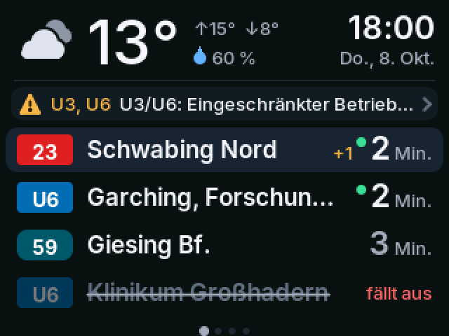
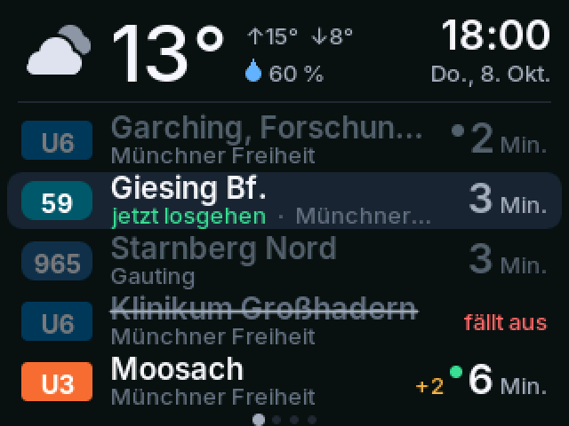
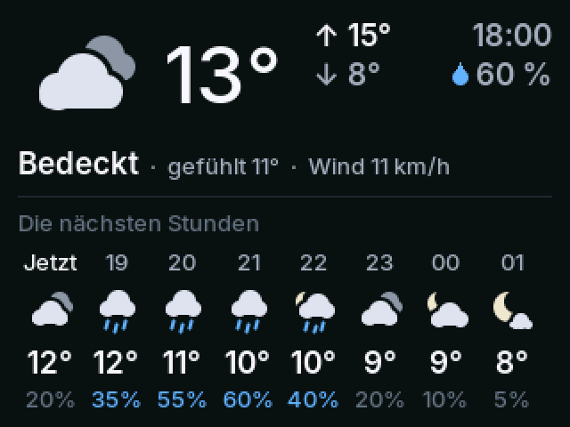
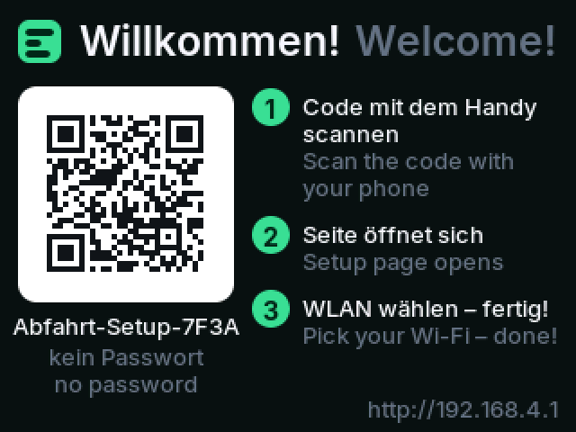
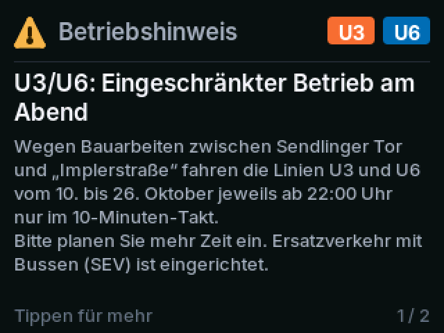
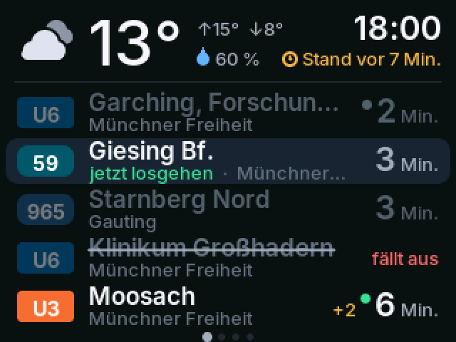

# Abfahrt – departures & weather for Munich on the ESP32 "Cheap Yellow Display"

A standalone desk display for the Munich area (MVG/MVV). It shows the current
weather and **one combined list of upcoming departures** from up to four stops,
with walking-time awareness ("leave in 3 min", departures you can no longer
reach shown greyed out), real-time delays, cancellations
and service notices. A non-technical person sets it up with a phone: plug in,
scan the QR code, pick the Wi-Fi, choose stops. German and English.

| Main screen | Two stops with walking time | Hourly forecast |
|---|---|---|
|  |  |  |
| **Setup hotspot** | **Service notice (paged)** | **Stale data** |
|  |  |  |

All device screenshots are rendered on a PC from test fixtures by the same
drawing code that runs on the device (see [Preview](#design-preview)). The phone
pages: [setup](docs/screenshots/web_setup_2_wifi.png),
[settings](docs/screenshots/web_settings_1_stops.png),
[line filter](docs/screenshots/web_settings_2_lines.png).

---

## Contents

1. [Hardware](#hardware)
2. [Flashing a ready-made build](#flashing-a-ready-made-build)
3. [Building from source](#building-from-source)
4. [Using it](#using-it)
5. [Architecture](#architecture)
6. [Data sources & caveats](#data-sources--caveats)
7. [Development](#development)
8. [Troubleshooting](#troubleshooting)

See also: [SETUP_CARD.md](SETUP_CARD.md) (printable guide for the recipient) ·
[DECISIONS.md](DECISIONS.md) (every assumption made).

---

## Hardware

ESP32-2432S028R ("CYD"), 2.8" 320×240 TFT, ESP32-D0WD, 4 MB flash, no PSRAM,
CH340 USB-serial. USB power only.

### Panel switches

There are (at least) two variants of this board, with different display
controllers. Panel ID reads are unreliable on both, so there is **no
auto-detection** – the choice is compile time, in
[`include/board_config.h`](include/board_config.h), and the two PlatformIO
environments set it for you:

| Board | PlatformIO env | `CYD_PANEL_ST7789` | `PANEL_INVERT` |
|---|---|---|---|
| **Two-USB CYD** (micro-USB **and** USB-C), ST7789 – verified | `cyd_st7789` (default) | `1` | `0` |
| Classic CYD, single micro-USB, ILI9341 | `cyd_ili9341` | `0` | `0` |

Rotation is 1 (landscape, USB ports on the right).

### Symptom guide

| What you see | Cause | Fix |
|---|---|---|
| Scrambled, repeated, shifted or striped image | wrong display driver | use the other env / flip `CYD_PANEL_ST7789` |
| Light/white background, greens look pink or red, "negative" look | colour inversion wrong | flip `PANEL_INVERT` |
| Red and blue swapped (the orange U3 badge looks blue) | RGB/BGR order | flip `PANEL_BGR` |
| Image upside down / USB on the left | rotation | change `PANEL_ROTATION` (1 ↔ 3) |
| Taps land in the wrong place | touch not calibrated | Settings page → *Calibrate touch*, or hold BOOT 3–10 s |
| Black screen, serial log OK | backlight | check `PIN_TFT_BL` (21) |

Flags can also be set without editing files, e.g. in `platformio.ini`:
`build_flags = ${esp32_base.build_flags} -DCYD_PANEL_ST7789=1 -DPANEL_INVERT=1`.

### Pins (for reference)

| Function | Pins |
|---|---|
| Display (HSPI / SPI2_HOST, 40 MHz) | SCLK 14, MOSI 13, MISO 12, DC 2, CS 15, RST –, backlight PWM 21 |
| Touch XPT2046 (own bus, SPI3_HOST) | CLK 25, MOSI 32, MISO 39, CS 33, IRQ 36 |
| RGB LED (active LOW, switched off) | 4 / 16 / 17 |
| Light sensor (LDR) | 34 |
| BOOT button | 0 |

---

## Flashing a ready-made build

Every push builds the firmware on GitHub Actions.

1. Open the repository's **Actions** tab → latest successful **Build & test** run.
2. Download the artifact **`firmware-cyd_st7789`** (or `firmware-cyd_ili9341`
   for the classic board) and unzip it.
3. Use the file **`cyd_st7789-merged-0x0.bin`**. It contains bootloader,
   partition table and app and is written at **offset `0x0`**.

Connect the board with a USB **data** cable. On Windows/macOS you may need the
[CH340 driver](https://www.wch-ic.com/downloads/CH341SER_EXE.html) first.

### Option A – esptool (command line)

```bash
pip install esptool
# Linux: /dev/ttyUSB0   macOS: /dev/cu.usbserial-*   Windows: COM3 …
esptool.py --chip esp32 --port /dev/ttyUSB0 --baud 460800 \
  write_flash 0x0 cyd_st7789-merged-0x0.bin
```

Use **460800** baud; 921600 fails on these boards. If the upload does not start,
hold **BOOT**, tap **RST**, release BOOT, and retry. To start completely fresh
first run `esptool.py --chip esp32 --port … erase_flash` (this also erases the
saved settings).

### Option B – in the browser (no installation)

1. Open <https://espressif.github.io/esptool-js/> in **Chrome or Edge**
   (desktop; Web Serial is required).
2. Set the baud rate to **460800**, click **Connect**, pick the
   *USB-Serial CH340* port.
3. Under *Flash Address* enter **`0x0`**, choose the `…-merged-0x0.bin` file,
   click **Program**.
4. When it finishes, press **RST** on the board (or unplug/replug).

The individual images (`bootloader 0x1000`, `partitions 0x8000`,
`boot_app0 0xe000`, `app 0x10000`) are included too, if your tool prefers them.

---

## Building from source

```bash
pip install platformio
pio run -e cyd_st7789                 # build (also writes firmware-merged.bin)
pio run -e cyd_st7789 -t upload       # flash at 460800 baud
pio device monitor                    # 115200 baud logs
pio test -e native                    # unit tests on the PC
```

| Env | Purpose |
|---|---|
| `cyd_st7789` | two-USB board, release (`CORE_DEBUG_LEVEL=1`) – **default** |
| `cyd_ili9341` | classic single-USB board, release |
| `cyd_st7789_debug` | two-USB board with `CORE_DEBUG_LEVEL=3` |
| `native` | unit tests (`pio test -e native`) |
| `preview` | renders all screens to PNG (`pio run -e preview && .pio/build/preview/program`) |

Toolchain: pioarduino platform **53.03.13** (Arduino core 3.1.x), board
`esp32dev`, partitions `huge_app.csv` (no OTA). Libraries: LovyanGFX,
ArduinoJson 7, ESP32Async/AsyncTCP + ESPAsyncWebServer. DNS server, mDNS,
Preferences and HTTPClient come with the core; the QR encoder is the one built
into LovyanGFX.

---

## Using it

### First setup
See [SETUP_CARD.md](SETUP_CARD.md). In short: the display opens a hotspot
`Abfahrt-Setup-XXXX` and shows a QR code to join it; the phone's captive portal
opens; choose language and Wi-Fi. The display then shows a second QR code /
`http://abfahrt.local` / its IP address – that opens the settings page on the
home network, where stops are chosen.

### Touch (taps and long-press only – no swipes)

| Where | Tap | Long-press (1 s) |
|---|---|---|
| Header (weather, clock) | hourly forecast | settings QR + URL |
| Notice banner | service notice, tap to page through | settings QR + URL |
| Departure list | next page (up to 4 pages, dots at the bottom); back to page 1 after 20 s | settings QR + URL |
| Any detail screen | back (notices: next page, then back) | settings QR + URL |
| Settings QR screen | *Reset…* button → confirmation screen | – |
| Reset confirmation | *Cancel* closes | **hold *Erase*** → erase everything |
| "No Wi-Fi" screen | – | re-open the setup hotspot |
| At night (screen dark/dim) | wakes the screen for 30 s | – |

Detail screens return to the board automatically after 30 s.

### BOOT button

| Hold | Result |
|---|---|
| 2 s | countdown appears |
| release between 3 and 10 s | touch calibration |
| 10 s, then release | factory reset and restart (the screen says "release now") |

The button only counts after it has been seen released once after power-on,
and presses longer than 30 s are ignored as a stuck pin – GPIO0 is wired to the
USB-serial auto-reset circuit, and some serial monitors hold it low.

### Starting over (new owner / new setup)
Three ways to erase **everything** – Wi-Fi, stops, settings, touch calibration
and the whole NVS flash partition – after which the device restarts into the
setup hotspot exactly like a new unit:
1. On the device: long-press anywhere → **Reset…** → press and hold **Erase**.
2. Settings page → **Erase everything & set up again**.
3. Hold **BOOT** for 10 s, then release (works even without Wi-Fi or touch).

### Which page is reachable when
| Page | Reachable | How |
|---|---|---|
| Wi-Fi setup | only over the `Abfahrt-Setup-XXXX` hotspot | first boot, after a reset, *Change Wi-Fi*, or long-press on "No Wi-Fi" |
| Settings (stops etc.) | any time on the home network | `http://abfahrt.local` or the IP; QR on the display (shown automatically while no stops are set, otherwise long-press) |

On the home network `/setup` redirects to the settings page; Wi-Fi is changed
via *Change Wi-Fi* there (the device restarts into the hotspot).

### Settings page (`http://abfahrt.local` or the IP shown on the display)
Stops (search, up to 4), walking time, short label, transport types, line &
direction filter (built from the stop's current departures), language,
weather location override, brightness, automatic brightness, night mode
(off / dim / dark, time window), touch calibration, change Wi-Fi, erase everything.

---

## Architecture

```
            core 1 (Arduino loop)                      core 0 (net task, 16 KB stack)
 ┌────────────────────────────────────┐     ┌──────────────────────────────────────────┐
 │ app/app.cpp  screen state machine   │     │ net/net_task.cpp                          │
 │   touch (tap/long) · BOOT · night   │     │   Wi-Fi state machine, captive DNS,       │
 │   backlight (LDR) · calibration     │     │   NTP (CET/CEST), mDNS, fetch scheduler,  │
 │        │ fillFromSnapshot()         │     │   background jobs (search, line lists)    │
 │        ▼                            │     │        │ TransportProvider (MvgProvider)  │
 │ ui/  ViewModel → drawScreen()       │     │        │ WeatherProvider (OpenMeteo)      │
 │      Painter → BandRenderer         │     │        ▼ EspHttp (HTTPS, streamed)        │
 │      320×40 sprite, hash per band   │     └────────────────┬─────────────────────────┘
 └───────────────┬────────────────────┘                       │
                 │          app/shared.h: Shared g + mutex     │
                 └──────────► settings · DataSnapshot · ◄──────┘
                              net status · jobs · requests
                                         ▲
                     net/web_server.cpp (AsyncTCP task): setup portal + JSON API
```

| Directory | Contents | Hardware? |
|---|---|---|
| `include/board_config.h` | panel switches, pins, LDR thresholds, product name | – |
| `lib/core/` | data model, MVG + Open-Meteo parsers, board logic (merge/filter/walk time), settings JSON, i18n, line colours, provider interfaces | none – unit tested |
| `lib/ui/` | theme, fonts, painter, icons, widgets, screens, band renderer, view model | LovyanGFX only – runs on the PC |
| `src/firmware/hw/` | LovyanGFX device, touch gestures, LDR, BOOT, LED, backlight | yes |
| `src/firmware/net/` | Wi-Fi/portal/fetch task, HTTPS fetcher, web server | yes |
| `src/firmware/app/` | UI loop/state machine, shared state, NVS storage, logging | yes |
| `src/firmware/web/web_assets.h` | gzipped pages (generated from `web/`) | – |
| `src/preview/` | host renderer for screenshots | – |
| `web/` | setup + settings pages (source) | – |
| `tools/` | font generator, web asset builder, merged-bin step, fixtures, web preview | – |

### Rendering
* No full framebuffer (320×240×2 = 150 kB does not fit reliably without PSRAM).
  Each frame is drawn **band by band** into one 320×40 16-bit sprite (25.6 kB).
  Screens draw in screen coordinates; the `Painter` offsets by the band and skips
  primitives outside it.
* After a band is drawn its pixels are hashed (FNV-1a); it is pushed only if
  the hash changed. A countdown tick therefore re-sends just one or two bands –
  smooth, flicker-free, no manual dirty tracking.
* `pushSprite()` may return while DMA is still reading, so `waitDMA()` runs
  before the buffer is reused. Single buffer, no double buffering.
* Text uses anti-aliased **VLW fonts generated from Inter** (`tools/gen_fonts.py`,
  Latin-1 + typographic extras, 5 sizes, embedded as PROGMEM). Font objects are
  created once. Text is drawn without background so it blends into the sprite.
* Weather icons and line badges are vector-drawn with anti-aliased primitives.
* All colours are `uint32_t` RGB888 constants in `lib/ui/src/theme.h`
  (plain int literals would be read as RGB565).

### Networking
* HTTPS with `WiFiClientSecure::setInsecure()` + `HTTPClient::useHTTP10(true)`;
  the body is parsed straight from the stream with ArduinoJson filters.
  Array responses are parsed **one element at a time**, so memory is bounded by
  one element (the MVG messages feed can be hundreds of kB).
* Departures every 45 s (20 s after an error), service messages every 5 min,
  weather every 15 min (2 min retry), staggered after the first fetch.
* Free heap, min heap and largest block are logged every 60 s; LDR raw values
  every 30 s (always on, independent of `CORE_DEBUG_LEVEL`).
* Settings page requests that need the internet (stop search, line lists) are
  queued as jobs for the net task and polled by the page, so the async web
  server never blocks.

### Persistence
NVS namespace `abfahrt`: `cfg` (settings JSON incl. touch calibration),
`ssid`/`pass` (Wi-Fi). Factory reset clears the namespace, the Wi-Fi driver's
store, and then erases the entire NVS partition (`nvs_flash_erase`).

---

## Data sources & caveats

### Departures – MVG (unofficial)
`https://www.mvg.de/api/bgw-pt/v3/…` is the API behind mvg.de. It needs no key,
which is why it was chosen (the gift works for anyone), and also covers MVV
regional stops (S-Bahn, regional buses).

* **It is not a public, documented API.** MVG can change or block it at any
  time without notice; there is no SLA. If it breaks, the display shows
  "MVG unreachable" with the age of the last data.
* Used endpoints: `locations?query=…&locationTypes=STATION`,
  `departures?globalId=…&limit=20[&transportTypes=…]`, `messages`.
* Request volume is modest (one request per stop every 45 s, messages every
  5 min). Please don't lower the intervals much.
* The provider sits behind `core::TransportProvider`; an MVV EFA
  (`efa.mvv-muenchen.de`, rapidJSON) implementation can be added without
  touching UI or logic.
* Parsers tolerate missing/renamed fields (`departureTimePlanned`, `line.label`,
  `product`, `direction`, seconds vs milliseconds, wrapped arrays…).

### Weather – Open-Meteo
`https://api.open-meteo.com/v1/forecast` with current conditions, today's
high/low, hourly temperature/precipitation probability/weather code,
`timezone=Europe/Berlin`, `timeformat=unixtime`. Free for non-commercial use,
no key; data under **CC BY 4.0** (attribution is on the settings page).
The location defaults to the first stop's coordinates and can be overridden.

### Line colours
`lib/core/src/line_style.cpp` approximates the official MVG/MVV palette
(U-Bahn per line incl. split U7/U8, S-Bahn per line, tram red, bus teal,
night lines dark, regional bus blue). Adjust there if needed.

### ⚠️ Fixtures are synthetic
The environment this was developed in could not reach mvg.de or open-meteo.com,
so `test/fixtures/*.json` were built from the known response shapes (see
[test/fixtures/README.md](test/fixtures/README.md)). Run
`tools/fetch_fixtures.sh` once on a normal machine; `test_real_fixtures` then
checks the parsers against real responses.

---

## Development

### Unit tests
```bash
pio test -e native
```
Parsers against fixtures (incl. chunked streams and alternative shapes), board
logic (merge, sort, filters, walking time, catchable highlight, countdown),
settings round-trip/clamping, i18n completeness (every key in both languages,
matching `printf` specifiers, all characters present in the fonts).

### Design preview
```bash
pio run -e preview && .pio/build/preview/program   # -> docs/screenshots/*.png
python3 tools/web_preview.py serve                  # web pages with a mock API
python3 tools/web_preview.py screenshots            # needs: pip install playwright
```
The preview uses LovyanGFX on the host (`-DLGFX_LINUX_FB`, headless – only
in-memory sprites are used) and the same band renderer as the device.

### Regenerating generated files
| File | Command |
|---|---|
| `lib/ui/src/fonts/*.h` | `pip install freetype-py && python3 tools/gen_fonts.py` |
| `src/firmware/web/web_assets.h` | automatic on every build (`tools/build_web.py`) |
| `test/fixtures/*.json` (synthetic) | `python3 tools/make_synthetic_fixtures.py` |
| `test/fixtures/real/*` | `tools/fetch_fixtures.sh` |

### Tuning constants
* LDR: `LDR_BRIGHT_RAW`, `LDR_DARK_RAW`, `LDR_MIN_PERCENT` in `board_config.h`.
  Watch the `LDR raw=…` log lines in a bright and in a dark room and set them.
* Touch defaults before calibration: `TOUCH_X_MIN…`, `TOUCH_OFFSET_ROTATION`.
* Fetch intervals: top of `src/firmware/net/net_task.cpp`.
* Colours/spacing/type scale: `lib/ui/src/theme.h` (mirrored in the CSS
  variables of `web/*.html`).

---

## Troubleshooting

* **Serial log** (115200 baud) shows Wi-Fi state, every HTTP request with status
  and duration, heap and LDR readings.
* `setSocketOption(): fail on 0, errno: 9` from HTTPClient is harmless.
* **Phone does not open the setup page:** open `http://192.168.4.1` manually
  while connected to `Abfahrt-Setup-XXXX`. Turn off mobile data if the phone
  keeps leaving the hotspot ("no internet").
* **`abfahrt.local` does not resolve** (some Android versions): use the IP
  address shown on the display (long-press the screen).
* **Router changed:** settings page → *Change Wi-Fi*, or long-press the
  "No Wi-Fi" screen to open the setup hotspot; BOOT 10 s resets everything.

## Licenses
Firmware code: no license file has been added yet (your choice). Inter font: SIL Open Font License 1.1
(`tools/fonts/Inter-LICENSE.txt`). Weather data: Open-Meteo.com, CC BY 4.0.
